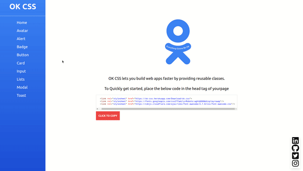

# About OK CSS

OK CSS lets you build web apps faster by providing reusable classes.
# Getting Started 

### To Quickly get started, place the below code in the head tag of yourpage.

```
    <link rel="stylesheet" href="https://ok-css.netlify.app/Download/ok.css">
    <link rel="stylesheet" href="https://fonts.googleapis.com/css2?family=Roboto:wght@300&display=swap"/> 
    <link rel="stylesheet" href="https://cdnjs.cloudflare.com/ajax/libs/font-awesome/4.7.0/css/font-awesome.css"/>
```

## Preview


## Live Site

https://ok-css.netlify.app/
